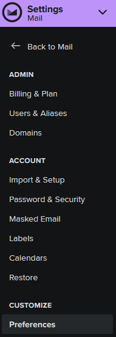
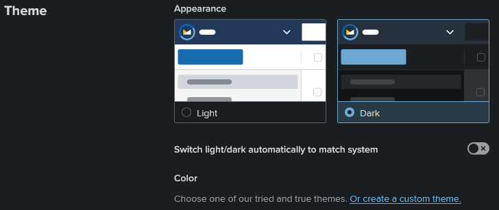
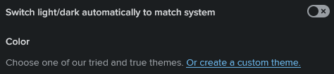
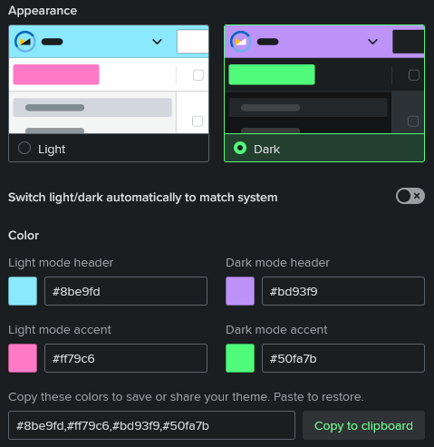

### [Fastmail](https://fastmail.com)

#### Install using Git

If you are a git user, you can install the theme and keep up to date by cloning the repo:

    git clone https://github.com/dracula/fastmail.git

#### Install manually

Download using the [GitHub .zip download](https://github.com/dracula/fastmail/archive/master.zip) option and unzip them.

#### Activating theme

Log into your Fastmail account. Navigate to the preference settings.

Mail > Settings > Customize > Preferences

In the Theme section of the preferences panel, click on the "Or create a custom theme" link to reveal the color options.

Enter the desired hexidecimal color options into the Light mode header, Dark mode header, Light mode accent, and Dark mode accent boxes. As you update color options, a preview will be generated showing your selections

Palette      | Hex       | 
---          | ---       | ---
Background   | `#282a36` | 
Current Line | `#44475a` | 
Selection    | `#44475a` | 
Foreground   | `#f8f8f2` | 
Comment      | `#6272a4` | 
Cyan         | `#8be9fd` | 
Green        | `#50fa7b` | 
Orange       | `#ffb86c` | 
Pink         | `#ff79c6` | 
Purple       | `#bd93f9` | 
Red          | `#ff5555` | 
Yellow       | `#f1fa8c` | 

